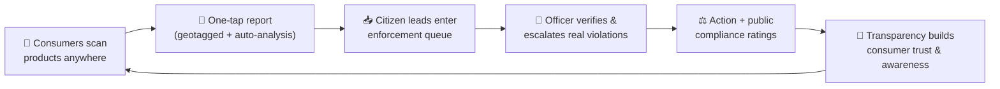
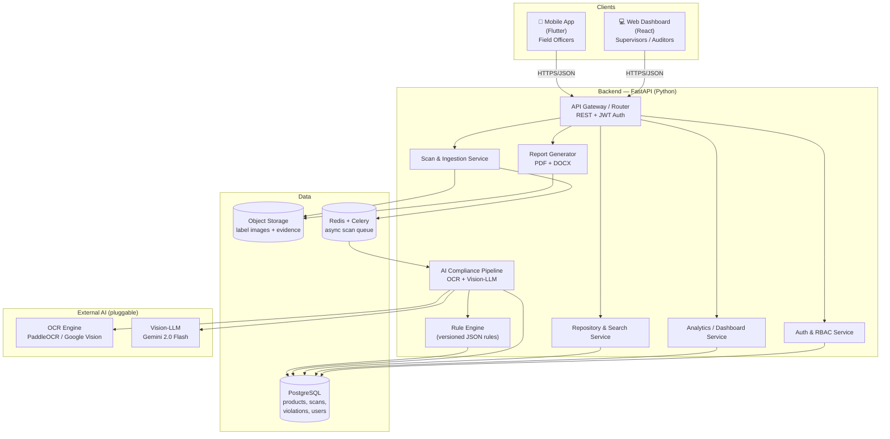
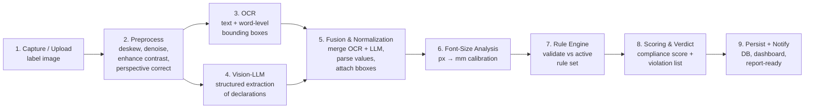
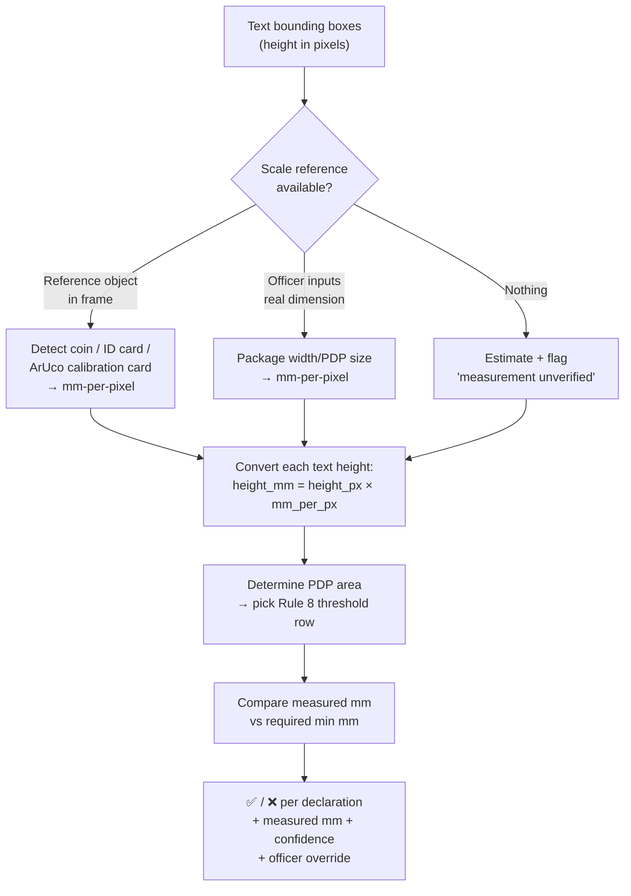
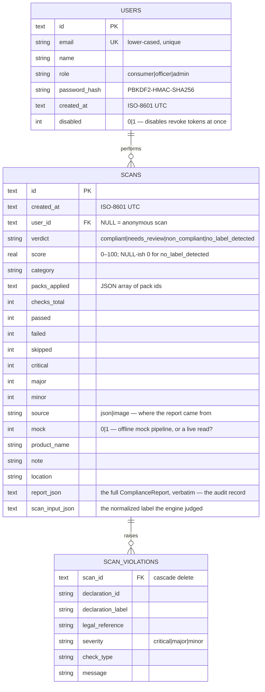
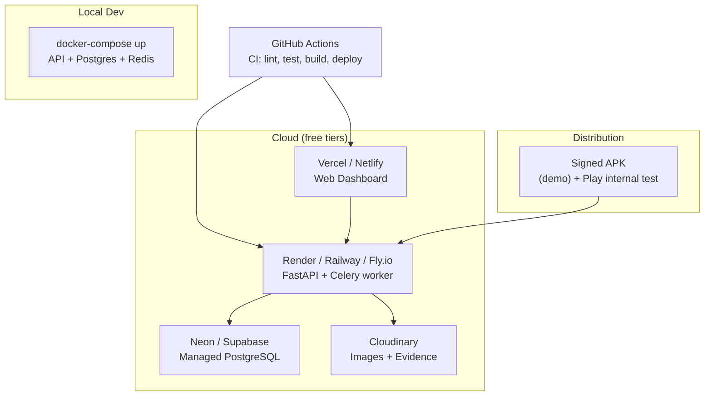

# Label Jaano — System Architecture & Technical Design

**Automated Legal Metrology Compliance for Packaged Commodities**
*Smart India Hackathon — Software System to check compliance of Packaged Commodities under the Legal Metrology (Packaged Commodities) Rules, 2011*

> **One-liner:** Point your phone at any packaged product. In seconds, Label Jaano reads the label, checks every mandatory declaration against the Legal Metrology (Packaged Commodities) Rules, 2011, flags violations with legal references, and files a court-ready compliance report — while enforcement officers monitor everything from a live dashboard.

---

## Table of Contents

1. [The Product Vision](#1-the-product-vision)
2. [Design Principles (why this wins)](#2-design-principles-why-this-wins)
3. [High-Level Architecture](#3-high-level-architecture)
4. [Recommended Tech Stack](#4-recommended-tech-stack)
5. [The Compliance Intelligence Pipeline](#5-the-compliance-intelligence-pipeline)
6. [The Rule Engine](#6-the-rule-engine)
7. [Font-Size & Readability Analysis (the hard part, solved)](#7-font-size--readability-analysis)
8. [Data Model](#8-data-model)
9. [API Design](#9-api-design)
10. [Mobile App Architecture](#10-mobile-app-architecture)
11. [Web Dashboard Architecture](#11-web-dashboard-architecture)
12. [Security, Auth & RBAC](#12-security-auth--rbac)
13. [Reports & Exports](#13-reports--exports)
14. [Repository & Search](#14-repository--search)
15. [Deployment & DevOps](#15-deployment--devops)
16. [MVP Scope & 1–2 Week Build Plan](#16-mvp-scope--12-week-build-plan)
17. [Requirement Traceability Matrix](#17-requirement-traceability-matrix)
18. [Roadmap & Differentiators](#18-roadmap--differentiators)
19. [Appendix: LMPC 2011 Reference](#19-appendix-lmpc-2011-reference)

---

## 1. The Product Vision

Packaged goods sold across India must carry mandatory declarations under the **Legal Metrology Act, 2009** and the **Legal Metrology (Packaged Commodities) Rules, 2011**. Manual inspection by enforcement officers is slow and cannot scale to the volume and variety of products on shelves and on e-commerce platforms.

**Label Jaano** turns compliance checking into a 10-second scan. The **enforcement workflow is the primary product** (exactly what the problem statement asks for); a lightweight **consumer mode** extends the *same engine* to the public and turns ordinary shoppers into a nationwide sensing network.

| Persona | Where | What they do | Scope |
|---|---|---|---|
| **Enforcement Officer** | Mobile app (field) | Scan products, review auto-detected violations, attach evidence photos, generate on-site reports. | **Core** |
| **Supervisor / Admin** | Web dashboard | Monitor inspections across regions, track violation trends, manage rule sets & users, export analytics. | **Core** |
| **Auditor / Legal (read-only)** | Web dashboard | Review historical reports and evidence for enforcement action. | **Core** |
| **Consumer (public)** | Mobile app (simple mode) | Scan any product for an instant plain-language compliance check; report suspected violations, which become citizen leads in the enforcement queue. | **Stretch — wow-factor** |
| **Manufacturer / Brand** | Web portal | Self-check labels *before* going to market (prevention). | **Future** |

The product covers the full loop demanded by the problem statement: **scan → extract → validate → report → store → monitor**.

### 1.1 The Wow Factor — Crowdsourced Enforcement

The problem statement's own background names the real bottleneck: enforcement *cannot scale* to the volume and variety of products. The consumer mode attacks that head-on. The **same scan → extract → validate engine** powers a public-facing app, but consumers get a jargon-free verdict and a one-tap **"Report this product."** Each report becomes a **geotagged citizen lead** in the officer's queue — photo and auto-analysis already attached — which an officer then verifies and escalates.

This creates a self-reinforcing loop that multiplies enforcement reach far beyond what a small staff could ever cover manually:



**Why it wins:** it converts a regulator-only tool into a national consumer-protection movement, it *directly solves the scale problem the statement complains about* rather than just digitizing manual inspection, and it costs almost nothing to build — the same backend and rule engine exposed through one extra role and a simplified screen. In the pitch, this is your closing beat: *"…and every shopper in India becomes an inspector."*

---

## 2. Design Principles (why this wins)

These principles are deliberate, and each maps to how hackathon submissions are judged.

1. **Legally grounded, not vibes-based.** Every pass/fail cites a specific Rule (e.g., "MRP not inclusive-of-taxes format — Rule 6(1)(e)"). This is what separates a toy OCR demo from a credible enforcement tool.
2. **Config-driven rule engine.** The Rules change (amendments in 2017, 2021, 2022…). Compliance logic lives in **versioned JSON rule sets**, not hardcoded `if` statements. Admins update rules without a code deploy. Judges love extensibility.
3. **Human-in-the-loop, with confidence scores.** AI proposes; the officer disposes. Every extracted field shows a confidence score and is editable. This makes the tool trustworthy and legally defensible.
4. **Honest about the hard problem (font size).** We don't hand-wave measurement — we solve pixel-to-millimetre calibration explicitly (Section 7). Acknowledging and solving the hardest requirement is a differentiator.
5. **Offline-tolerant.** Field connectivity is unreliable. The mobile app queues scans locally and syncs when back online.
6. **Demo-first MVP, production-shaped architecture.** The 1–2 week build focuses on a flawless core demo, but the architecture is drawn for real deployment so the technical documentation reads like a real system.

---

## 3. High-Level Architecture

Label Jaano uses a **client → API gateway → modular services → data stores** architecture. For the hackathon MVP the services run inside one FastAPI application (a "modular monolith"), but they are cleanly separated so they can be split into microservices later.



**Request lifecycle in one sentence:** the app uploads a label image → the Scan service stores it and enqueues a job → the AI pipeline reads the text and extracts structured declarations → the Rule Engine validates them against the active rule set → results, violations and a compliance score are persisted → the officer sees the verdict and can generate a report; supervisors see it roll up on the dashboard.

### 3.1 Implementation status — what runs today

This document is the design; the repo is the build, and the two have deliberately
converged. Every capability in the sections below is implemented and tested, with
three pragmatic substitutions made for the hackathon window. None of them changes the
architecture — each is a different engine in the same slot.

| Design choice | Implemented as | Why this is honest, not a shortcut |
|---|---|---|
| PostgreSQL + SQLAlchemy | **SQLite via `sqlite3`** (stdlib) | The requirements say "repository of scanned products and inspection history," not "Postgres." SQLite is a real relational database with transactions, WAL, and full-text-friendly `LIKE` search — it serves a single-node demo box with zero install. `store/` is the only module that talks to it; moving to Postgres later touches one file, not the system. |
| JWT via python-jose + passlib/bcrypt | **Hand-rolled HMAC-SHA256 tokens + PBKDF2-HMAC-SHA256 passwords** (stdlib) | Two purpose-scoped token kinds (`api` sessions, 12 h; `report` share tickets, 15 min) with role + scope claims, constant-time verification, and revocation-by-disabled-account — the security properties that matter, with no third-party auth dependency to break on a demo stage. |
| WeasyPrint PDF + python-docx | **Print-ready HTML report** (`reports/inspection_html.py`) | The file an inspector needs is a document they can print. The report is self-contained HTML that renders identically in any browser (Print → Save as PDF gives the PDF), plus an admin CLI that exports it offline. |

What is **also** built, beyond the original design's scope: the two-tier rule model
(Tier 1 photo-verifiable checks that score; Tier 2 lab-only `reference_standards` that
can never affect the score), the corpus-wide `/stats` aggregates an officer quotes
from a dashboard, scoped share links that hand over one report and never the account,
and a demo seeding CLI (`manage.py seed`) that populates a walkthrough corpus in one
command.

Coverage today: **8 rule packs** (Legal Metrology 2011 + 7 FSSAI), **18 API routes**,
**7 test modules / ~200 tests**, backend and Flutter app wired end-to-end. See
[`backend/README.md`](backend/README.md) for the runbook and the full route table.

---

## 4. Recommended Tech Stack

You asked me to pick the strongest stack. Here it is, with the reasoning — this is the combination I'd bet on to win, balancing **demo polish**, **AI power**, and **speed of execution** in a 1–2 week window.

| Layer | Choice | Why this, for winning |
|---|---|---|
| **Mobile app** | **Flutter (Dart)** | One codebase → Android + iOS. Best-in-class camera & image handling, gorgeous UI out of the box, trivial to ship a demo APK. Faster to a polished demo than React Native. |
| **Web dashboard** | **React + Vite + TypeScript**, **Tailwind CSS + shadcn/ui**, **Recharts**, **TanStack Query** | Fastest path to a clean, professional dashboard. shadcn/ui gives premium components for free; Recharts for compliance analytics. |
| **Backend API** | **Python + FastAPI** | Async, auto-generated Swagger docs (great for the demo), Pydantic validation, and it lives in the same language as all the AI/ML libraries — zero glue code between API and AI. |
| **OCR** | **PaddleOCR** (open-source, Hindi + English) with **Google Cloud Vision** as an accuracy booster | PaddleOCR returns **word-level bounding boxes** — essential for font-size measurement — and runs free/offline. Google Vision available as a high-accuracy fallback. |
| **Vision-LLM** | **Google Gemini 2.0 Flash** | Fast, cheap, strong multimodal reasoning, generous free tier (ideal for a hackathon budget). Extracts *structured* declarations even from messy labels. Pluggable — GPT-4o / Claude as drop-in alternatives. |
| **Image processing** | **OpenCV + Pillow** | Deskew, contrast enhancement, perspective correction, reference-object detection for calibration. |
| **Rule engine** | **Custom Python module + versioned JSON rule sets** (validated by JSON Schema) | The core IP. Declarative, auditable, admin-editable, versioned by rule-effective-date. |
| **Database** | **PostgreSQL 15+** (SQLAlchemy 2.0 + Alembic) | Relational integrity for products/scans/violations, plus native full-text search (`tsvector`) for the repository. |
| **Object storage** | **Cloudinary** (free tier) or **Supabase Storage / S3 / MinIO** | Stores label images + evidence photos; Cloudinary gives free image transforms & CDN delivery. |
| **Async processing** | **Redis + Celery** | Scan jobs run in the background so the app stays snappy. (Optional for MVP — can run synchronously first.) |
| **Auth** | **JWT (OAuth2 password flow)** via python-jose + passlib/bcrypt | Stateless, role-based, works identically for mobile and web. |
| **Reports** | **WeasyPrint** (HTML→PDF) + **python-docx** (editable DOCX) | Pixel-perfect PDF from an HTML template; DOCX for the "editable format" requirement. |
| **Deployment** | **Docker + docker-compose**; backend → Render/Railway/Fly.io, web → Vercel/Netlify, DB → Neon/Supabase, images → Cloudinary; CI/CD → GitHub Actions | One-command local spin-up; free-tier cloud hosting for the live demo. |

**Guiding rationale:** Python + FastAPI keeps the *entire* AI stack in one language, Flutter gets you a beautiful field app fastest, and every AI provider is behind an interface so you're never locked in. Everything here has a generous free tier — important for a student team.

---

## 5. The Compliance Intelligence Pipeline

This is the heart of the system. A raw photo becomes a structured, validated compliance verdict through a deterministic pipeline. Each stage is independently testable.



**Stage-by-stage:**

1. **Capture / Upload** — Mobile camera (with guide overlay for framing) or gallery/e-commerce screenshot upload. Multiple angles allowed (front + back + side panels).
2. **Preprocessing (OpenCV)** — Auto-crop to the package, deskew, correct perspective to a fronto-parallel view, boost contrast. This dramatically improves both OCR and font measurement.
3. **OCR** — PaddleOCR extracts every text token **with bounding boxes and confidence**. Bounding boxes are the raw material for font-size checking. Google Vision can be swapped in for tougher labels.
4. **Vision-LLM structured extraction** — In parallel, the label image (+ OCR text as context) is sent to Gemini with a strict prompt: *"Extract these fields as JSON: manufacturer_name, manufacturer_address, generic_name, net_quantity, mrp, mfg_date, consumer_care, country_of_origin, unit_sale_price. Return null for any not present. Do not invent values."* The LLM handles layout chaos, abbreviations ("Mfd.", "Net Wt."), and multilingual text far better than regex alone.
5. **Fusion & Normalization** — Merge the LLM's structured fields with OCR bounding boxes (spatially match each field back to its text region so we know *where* it sits and *how tall* it is). Normalize values: parse `₹49/-` → `49.00`, `500 g` → `{value: 500, unit: "g"}`, `MFD 03/2025` → `2025-03`.
6. **Font-Size Analysis** — Convert each declaration's pixel height to millimetres and compare against the Rule 8 threshold (Section 7).
7. **Rule Engine** — Run the active rule set over the normalized declarations (Section 6).
8. **Scoring & Verdict** — Produce a compliance score (e.g., weighted % of rules passed), an overall **Compliant / Non-Compliant** verdict, and an itemized violation list with severities and rule references.
9. **Persist & Notify** — Save everything, update dashboards, mark the scan report-ready.

**Why OCR *and* an LLM?** OCR gives precise geometry (bounding boxes → font size) but no understanding. The LLM gives semantic structure (which text *is* the MRP) but no reliable geometry. Fusing both gives you accuracy the judges can see: correct fields *and* real measurements.

---

## 6. The Rule Engine

The rule engine is Label Jaano's core IP and its most defensible design decision. Compliance rules are **data, not code** — stored as a versioned JSON document so they can be audited, updated by an admin, and tied to the amendment date they came into force.

Each rule checks one aspect of one declaration. A declaration can be checked for five things:

- **Presence** — is the declaration there at all?
- **Format** — does it match the prescribed pattern (e.g., MRP must read "inclusive of all taxes")?
- **Value validity** — is the value sane (e.g., net quantity uses a standard metric unit; mfg date not in the future)?
- **Placement** — is it on the correct panel? Certain declarations (net quantity, MRP) must appear on the **Principal Display Panel**. With multi-panel capture (front/back), the Vision-LLM tags which panel each field sits on, so the engine can flag a declaration that exists but is in the wrong place.
- **Font / readability** — does the letter height meet the Rule 8 minimum for this package's display-panel area?

**Sample rule set (excerpt):**

```json
{
  "rule_set_version": "2011.2022-amend",
  "effective_date": "2022-01-01",
  "declarations": [
    {
      "id": "mrp",
      "label": "Maximum Retail Price",
      "legal_reference": "Rule 6(1)(e)",
      "required": true,
      "severity": "critical",
      "checks": [
        { "type": "presence" },
        {
          "type": "format",
          "regex": "(?i)(m\\.?r\\.?p|maximum retail price).*(incl|inclusive).*(all taxes)",
          "message": "MRP must be declared as 'Maximum Retail Price ₹__ inclusive of all taxes'."
        },
        { "type": "value", "validator": "positive_currency" }
      ]
    },
    {
      "id": "net_quantity",
      "label": "Net Quantity",
      "legal_reference": "Rule 6(1)(c)",
      "required": true,
      "severity": "critical",
      "checks": [
        { "type": "presence" },
        { "type": "value", "validator": "standard_metric_unit" },
        {
          "type": "font_height",
          "source": "rule_8_pdp_area_table",
          "message": "Net quantity numerals are smaller than the minimum height required for this package size (Rule 8)."
        }
      ]
    },
    {
      "id": "consumer_care",
      "label": "Consumer Care Details",
      "legal_reference": "Rule 6(1)(f)",
      "required": true,
      "severity": "major",
      "checks": [
        { "type": "presence" },
        { "type": "format", "regex": "(?i)(consumer care|customer care|for complaints|toll[- ]?free)" }
      ]
    }
  ],
  "font_height_table": {
    "basis": "area_of_principal_display_panel_cm2",
    "note": "Values below reflect the commonly-cited Rule 8 table; load exact values from the current gazette. Larger of area-based and quantity-based minimum governs.",
    "thresholds": [
      { "max_area_cm2": 100,   "min_height_mm": 1 },
      { "max_area_cm2": 500,   "min_height_mm": 2 },
      { "max_area_cm2": 2500,  "min_height_mm": 4 },
      { "max_area_cm2": null,  "min_height_mm": 6 }
    ]
  }
}
```

**How it runs:** the engine loads the active rule set, iterates each declaration, executes its checks against the normalized extraction, and emits a `ValidationResult` per check: `{rule_id, declaration, status: pass|fail|warn, severity, legal_reference, observed, expected, message, confidence}`. Failed `critical` checks force an overall **Non-Compliant** verdict; `major`/`minor` reduce the compliance score.

Because rules are versioned by `effective_date`, a scan is always evaluated against the rules that were in force — important for legal defensibility and for handling the 2017/2021/2022 amendments cleanly.

---

## 7. Font-Size & Readability Analysis

This is the requirement most teams either skip or fake. Getting it right is a genuine differentiator, so it deserves its own design. The challenge: **OCR gives text height in pixels, but Rule 8 is specified in millimetres.** We need a reliable pixels-to-millimetres scale.

We offer a tiered strategy — from easiest to most accurate — and always report a **confidence level** with the result.



**Tier 1 — Reference-object calibration (recommended default).** The officer includes a known-size object in the frame:
- A **standard coin** (e.g., ₹5 coin ≈ 23 mm diameter) or an **ID/credit card** (85.6 × 54 mm, ISO/IEC 7810) — detected with OpenCV.
- Best of all: a small printed **ArUco/QR calibration card** placed next to the product. ArUco markers are detected with sub-pixel precision, giving a rock-solid `mm_per_pixel`. Hand these cards to officers.

**Tier 2 — Known-dimension input.** If no reference object, the officer enters one real measurement (package width, or the printed net quantity's panel size). The system derives the scale from that edge.

**Tier 3 — Estimate & flag.** With nothing to calibrate against, the system still computes *relative* legibility and clearly marks the font-size verdict as **"unverified — measurement needs a reference."** Honesty here builds trust; we never assert a millimetre value we can't defend.

**After calibration:** convert each declaration's pixel height to mm, determine the **Principal Display Panel area** (from the same calibration), select the matching Rule 8 threshold row, and compare. Perspective correction (Section 5, step 2) is applied first so foreshortening doesn't distort the measurement.

**Always human-verifiable:** the result screen shows *"Net quantity: measured 1.4 mm, required ≥ 2 mm → FAIL (medium confidence)"* with an override toggle. An officer can confirm or correct — and that correction is logged for the audit trail (and becomes training data later).

---

## 8. Data Model

SQLite — one file, `backend/data/labeljaano.db`, held with WAL journaling (`sqlite3`,
stdlib; see `store/db.py`). Schema versioning is a `user_version` pragma plus an
ordered migration list, so an existing demo database upgrades in place — and the
denormalised verdict/score/severity columns exist so `/stats` counts in SQL instead
of deserialising every stored report. This directly implements the "repository of
scanned products and compliance history" and "attachment of photographs and supporting
evidence" requirements: the *report* carries the evidence references, and the field
app keeps the photos (the API deliberately never stores an image — see §10).



One deliberate absence: there is no `products` table and no `audit_log`. The system
keys on *inspections*, and a product's history is the set of inspections whose
`product_name` matches — the fluid entity in the 2011 Rules' world is the package,
not the SKU, and a barcode-keyed product table would force a decision about merging
scans that the field cannot actually make. The report itself is the audit record
(`report_json` is immutable-by-practice: nothing in the API rewrites a filed scan).

---

## 9. API Design

REST over HTTP, JSON payloads, bearer-token auth (a purpose-scoped HMAC token rather
than an off-the-shelf JWT library — see §12). FastAPI auto-publishes interactive
Swagger docs at `/docs`. The full route table with auth requirements lives in
[`backend/README.md`](backend/README.md); the shape of it:

**Auth & Users**
- `GET /auth/config` · `POST /auth/register` · `POST /auth/login` · `GET /auth/me` · `POST /auth/refresh`

**Scanning & Results**
- `POST /scan/image` — photo(s) → `ComplianceReport` in one call; with a bearer token the scan is **filed** and a `scan_id` comes back, without one you get the verdict and nothing is recorded
- `POST /scan` · `POST /extract` — normalize-then-judge split, for non-mobile clients

**History, Repository & Search**
- `GET /scans` — filtered (`verdict`, `category`, `search`), paged (`limit`/`offset`); scope decided by the server: an officer gets the whole corpus, a consumer their own — and the payload says which, so the client never has to guess
- `GET /scans/{id}` · `DELETE /scans/{id}` — detail (with the report body) and delete; another account's record answers **404**, not 403
- `GET /stats` — corpus aggregates, incl. corpus-wide `top_violations` (the "which declaration do sellers breach most often" answer, computed as a GROUP BY)

**Evidence & Reports**
- `POST /scans/{id}/share` — mint a short-lived link to this one report (`?minutes=`, default 15, max 120)
- `GET /scans/{id}/report.html` — print-ready inspection report; opens with a bearer token *or* the scoped share ticket, and a broken bearer is an error rather than a silent downgrade to link-holder access

**Rule Sets**
- `GET /rulepacks` · `GET /rulepacks/{id}` · `POST /reload` — audit and hot-apply rule packs without restarting

**Admin** — `manage.py` (not HTTP): `createuser`, `role`, `disable`, `passwd`, `scans`,
`stats`, `report`, `delete-scan`, `seed`, `secret`.


---

## 10. Mobile App Architecture

Flutter, structured for clarity and honesty — the app never claims the server knows
something it does not.

- **State management:** `provider` (ChangeNotifier) — four providers in a strict order
  that is load-bearing, not stylistic: `Settings` → `ApiClient` → `Session` →
  `ScanStore`. Each provider only reads backwards in that list, and the server address
  is passed as a **closure, not a string**, so changing it in Settings takes effect on
  the very next request.
- **Networking:** `http` (multipart for photos), one `ApiClient`, owned and disposed by
  the provider graph — screens never construct their own.
- **Local store:** in-memory only, by design. A bearer token in `SharedPreferences`
  would be plaintext on disk, so the session lives in memory and the server
  re-hydrates it on re-login; local `ScanRecord`s exist for one session and are kept
  because they hold the **photos** (the API never stores an image).
- **One row type:** the queue and the dashboard consume `SavedScan` whether signed in
  or not — anonymous mode is not a second, less-tested rendering path, it is the same
  path with `filed: false`. Local scans are merged with server rows by id so a scan
  just taken never double-counts.
- **Session lifecycle:** every 401 funnels through `Session.handleFailure`, so the app
  can never be half-signed-in; app resume sequences `refreshIfNeeded()` then
  `revalidate()` (run in parallel, the slower one would restore the token the other
  had just replaced); a session that ends by itself is announced with *why* and the
  queue is reset, because the rows on screen belonged to that session.
- **Key screens:** Shell (Dashboard · Scan · Queue · Settings, kept alive in an
  `IndexedStack` so a half-filled scan form survives a tab switch) → **Capture**
  (front/back panel slots, category, calibration, mock toggle) → **Result** (verdict
  banner, declaration checklist, violation list, share-copy report link, export) →
  **Queue** (filter by verdict, server-side search, owner labels on an officer's
  queue) → **Dashboard** (aggregates; server `/stats` when signed in, device-local
  honest fallback when not).

```
lib/
  core/         # theme, config (server address, categories), LabelJaanoTheme
  models/       # ComplianceReport, SavedScan, ScanRecord, Account, AuthSession
  services/     # ApiClient, Session, ScanStore, Settings
  screens/      # home_shell, dashboard, scan, queue, report, settings, sign_in
  widgets/      # charts (donut/severity), verdict banner, scan tile, stat cards, brand
```

The result screen overlaying pass/fail directly on the label image (with bounding
boxes) is the **money shot for the demo** — it makes the AI visible and trustworthy.
The report screen also prints the honest provenance line (live read vs offline mock)
so a canned demo verdict is never mistaken for a real model read — the single most
important flag in the whole app.

---

## 11. Web Dashboard Architecture

React + Vite + TypeScript + Tailwind + shadcn/ui, data via TanStack Query, charts via Recharts.

**Key views:**
- **Overview** — KPI cards (total scans, compliance rate, open violations, top violation type), trend chart, map/region breakdown.
- **Inspections** — searchable, filterable table of all scans; drill into any scan (image + declarations + violations + evidence + report).
- **Violations** — aggregated by type/severity/brand/region; the "where are the problems" view.
- **Products repository** — full-text search across scanned products with compliance history.
- **Rule Sets** *(admin)* — view/edit/activate versioned rule sets, JSON editor with validation.
- **Users** *(admin)* — manage officers, roles, regions.

```
src/
  api/          # typed API hooks (TanStack Query)
  components/   # shadcn/ui-based building blocks
  features/     # overview, inspections, violations, repository, rules, users
  layouts/      # auth guard, role guard, shell
  lib/          # auth, formatting, charts config
```

---

## 12. Security, Auth & RBAC

- **Authentication:** purpose-scoped HMAC-SHA256 tokens (HS256-shaped), signed with
  `LABEL_JAANO_SECRET`. Two kinds, and the payload signing them says which: `api`
  sessions (12 h — one inspection shift) that work everywhere, and `report` share
  tickets (15 min default, scan-bound) that work on exactly one `report.html` URL and
  are **refused anywhere a session token is expected** — so forwarding a share link
  hands over one report, never the account. Passwords are PBKDF2-HMAC-SHA256 with a
  per-user salt and constant-time comparison; tokens die with a disabled account
  (the store checks `disabled` on every validation, not just at issue).
- **Authorization (RBAC):** enforced at the API with dependency guards.

| Role | Scan | View own | View all | Share a report | Manage accounts |
|---|:--:|:--:|:--:|:--:|:--:|
| **Officer** | ✅ | ✅ | ✅ | ✅ (anything they can read) | — |
| **Admin** | ✅ | ✅ | ✅ | ✅ | ✅ (via `manage.py`) |
| **Consumer** | ✅ | ✅ | — | ✅ (own only) | — |

An officer's *queue* spans the whole corpus; `/scans` and `/stats` report the scope
they actually searched (`own`/`all`) so the client can say whose records it is
showing instead of inferring from the role. Another account's inspection answers
**404, not 403** — a consumer cannot use error codes to map out what exists.

- **Data protection:** the server never stores label images (the phone keeps them);
  share links are short-lived, scoped, and parameterised through the same access
  logic as the API; input validation via Pydantic; `LABEL_JAANO_NO_DB=1` gives a
  read-only demo box whose auth endpoints answer 503 *honestly* rather than pretending.
- **Admin surface:** deliberately a CLI (`manage.py`) not an HTTP page — the only
  account-creation path for `admin`, plus role changes, disable (instant token
  revocation), password reset, and demo seeding. A demo stage has no business on a
  user-management HTTP API.

---

## 13. Reports & Exports

The problem statement explicitly wants **PDF and editable formats**. We produce both from the same data:

- **PDF** via **WeasyPrint** — render a branded HTML/CSS template (government header, scan photo with bbox overlays, declaration checklist, violation table with legal references, officer details, timestamp, QR code linking to the digital record). Pixel-perfect and print-ready.
- **Editable DOCX** via **python-docx** — same content as a Word document officers can edit before filing.
- **Evidence** photos are embedded/attached.
- Reports are stored (`reports` table + object storage) and retrievable from both apps.

A compliance report contains: product identity, scan image(s), the extracted declarations table (observed vs required), the itemized violations with **Rule references and severity**, the overall verdict and compliance score, officer + location + timestamp, and a verification QR code.

---

## 14. Repository & Search

- Every scan and its product are persisted → the **repository of scanned products and inspection history**.
- **Search:** PostgreSQL full-text search (`tsvector`) across product name, brand, generic name, manufacturer, and barcode; plus structured filters (verdict, region, officer, date range, violation type).
- **Product history:** a product accumulates multiple scans over time, so you can show whether a brand's compliance is improving or repeat-offending.

---

## 15. Deployment & DevOps



- **Containerized** with Docker; `docker-compose` brings up API + Postgres + Redis locally in one command.
- **CI/CD** via GitHub Actions: lint + test on PR, auto-deploy on merge.
- **Config** via environment variables (12-factor); secrets never in code.
- **Scaling path:** the modular monolith splits into services (AI pipeline as its own GPU-backed worker) when volume grows; Redis/Celery already decouples scan processing.
- **Observability:** structured JSON logging; optional Sentry for error tracking.

---

## 16. MVP Scope & 1–2 Week Build Plan

For the internal round, the goal is a **flawless core demo** — the full scan-to-report loop working on real products — not every checkbox. Build the spine first; add breadth only after it's solid.

### Must-have (the winning demo)
- Flutter app: login → capture/upload → result → generate PDF report.
- FastAPI backend: auth (2 roles), scan upload, the OCR + Gemini pipeline, rule engine covering the **6 core declarations** (manufacturer, net qty, MRP, mfg date, consumer care, country of origin), compliance verdict + score.
- Font-size check via **Tier 1/2 calibration** for net quantity (with confidence + override).
- PostgreSQL persistence + basic repository search.
- React dashboard: overview KPIs + inspections list + scan detail.
- PDF report export.
- Deployed to free-tier cloud + a demo APK.

### Stretch (add if time allows / for the finale)
- Editable DOCX export, evidence attachment UI, offline scan queue.
- Full RBAC incl. auditor, rule-set admin editor, analytics charts & trends.
- ArUco calibration card, perspective correction, multi-panel (front+back) merge.
- E-commerce listing check (paste a product URL/screenshot), manufacturer self-check portal.
- **Consumer mode (wow-factor):** public scan → plain-language verdict → one-tap report → citizen lead into the enforcement queue (reuses the same engine; see §1.1).

### Phased plan (≈10–12 working days)

| Phase | Days | Deliverable |
|---|---|---|
| **0. Setup** | 1 | Repo, docker-compose, DB schema + migrations, auth skeleton, CI. |
| **1. Pipeline core** | 2–4 | OCR + Gemini extraction returning normalized JSON on test images. Rule engine + JSON rule set for 6 declarations. Unit tests on sample labels. |
| **2. Backend API** | 4–6 | Scan upload → pipeline → persisted result + violations. Report PDF. Repository search. Swagger demo-ready. |
| **3. Mobile app** | 5–8 | Capture/upload, result screen with bbox overlays + verdict, report generation, history. |
| **4. Web dashboard** | 7–9 | Overview KPIs, inspections table, scan detail view. |
| **5. Font-size + polish** | 9–10 | Calibration + net-quantity height check with confidence/override. UI polish. |
| **6. Deploy + rehearse** | 10–12 | Cloud deploy, demo APK, seed demo data, **rehearse the demo script end-to-end**. |

### Demo script (2–3 minutes, high impact)
1. Officer logs in on the phone, scans a real product with a calibration card in frame.
2. In seconds: result screen shows the label with ✅/❌ overlaid — MRP present & correctly worded, net quantity present but **font too small (1.4 mm < 2 mm) → violation**, consumer care missing → violation.
3. Officer taps "Generate Report" → branded PDF with legal references appears.
4. Switch to the web dashboard: the scan is already there; compliance rate and violation-by-type chart update live.
5. **The wow beat:** switch to consumer mode — a shopper scans the same product, gets a plain-language *"⚠️ This label is missing consumer-care details,"* taps **Report**, and it instantly appears as a citizen lead on the officer's dashboard.
6. One line to close: *"Every verdict cites the exact Rule, the rules update without code, it works offline — and every shopper in India becomes an inspector."*

---

## 17. Requirement Traceability Matrix

Every functional requirement in the problem statement, mapped to where the architecture satisfies it — use this table directly in your submission to show completeness.

| # | Problem-statement requirement | Covered by |
|---|---|---|
| 1 | Image upload & product scanning | Mobile capture/upload; `POST /scans`; preprocessing (§5) |
| 2 | Extraction & detection of mandatory declarations | OCR + Vision-LLM pipeline (§5); declarations table (§8) |
| 3 | Correctness, completeness & placement checks | Rule engine presence/format/value checks (§6) |
| 4 | Identify missing / non-compliant declarations | Rule engine → violations with severity + legal reference (§6) |
| 5 | Font size & readability analysis | Calibration + Rule 8 table comparison (§7) |
| 6 | Detect missing / misleading / non-standard declarations | Rule engine format & value validators (§6) |
| 7 | Compliance / non-compliance reports | Report generator PDF + DOCX (§13) |
| 8 | Export to PDF and editable formats | WeasyPrint (PDF) + python-docx (DOCX) (§13) |
| 9 | Attach photographs & supporting evidence | Evidence entity + upload endpoint (§8, §9) |
| 10 | Repository of scanned products & inspection history | Products/Scans model + full-text search (§14) |
| 11 | Search & retrieval of past products/reports | `GET /products?q=`, filtered `/scans` (§9, §14) |
| 12 | Role-based access & secure authentication | JWT + RBAC guards, audit log (§12) |
| 13 | Dashboard for monitoring compliance & enforcement | React dashboard: overview, inspections, violations (§11) |
| 14 | Web and/or mobile application | Flutter app + React dashboard (§10, §11) |
| 15 | Rule-based compliance checking for LMPC 2011 | Versioned JSON rule engine (§6) |
| 16 | Technical documentation (architecture + deployment) | This document (§3, §15) |

**Beyond the brief:** the consumer crowdsourcing mode (§1.1), e-commerce checking, and manufacturer self-check exceed the stated requirements while directly serving their intent — consumer protection at scale.

---

## 18. Roadmap & Differentiators

Features that elevate Label Jaano from "good project" to "winning product":

- **Crowdsourced consumer enforcement** — the public scans & reports; geotagged citizen leads feed the enforcement queue, multiplying coverage far beyond a small officer corps (see §1.1). The flagship differentiator.
- **E-commerce compliance crawler** — paste an Amazon/Flipkart listing URL; the system scrapes the product images + listing text and runs the same checks. E-commerce is explicitly called out in the 2011 Rules' amendments and is a huge enforcement gap.
- **Manufacturer self-check portal** — prevention, not just enforcement; brands validate labels pre-launch.
- **Bulk/batch mode** — upload a folder of shelf photos; process in a queue.
- **Barcode/GTIN lookup** — auto-identify the product and pre-fill known data.
- **Analytics for policy** — heatmaps of non-compliance by region/category/brand for the Department of Consumer Affairs.
- **On-device lightweight model** — a distilled model for instant offline first-pass, syncing full analysis later.
- **Continuous learning** — officer corrections become labeled training data to fine-tune extraction accuracy over time.

---

## 19. Appendix: LMPC 2011 Reference

**Mandatory declarations (Rule 6):** name & complete address of manufacturer/packer/importer; common or generic name of the commodity; net quantity in standard metric units; month & year of manufacture/pre-packing/import; retail sale price as *"Maximum Retail Price ₹__ inclusive of all taxes"*; consumer care details (name, address, phone, email); country of origin (for imported packages); dimensions where applicable. Later amendments (2017, 2021, 2022) added the **unit sale price**, enhanced consumer-care and manufacturing details, and explicit **e-commerce** display obligations.

**Letter/numeral height (Rule 8):** declarations must be conspicuous, legible, and in a contrasting colour. Minimum height of numerals/letters scales with the **area of the Principal Display Panel** (commonly cited: ≤100 cm² → 1 mm; 100–500 cm² → 2 mm; 500–2500 cm² → 4 mm; >2500 cm² → 6 mm), with a parallel net-quantity-based minimum; the **larger** minimum governs. Width of a character must not be less than a set proportion of its height (with the usual exceptions for "1", "i", "l").

> ⚠️ **Verify exact values against the current gazette.** Load the authoritative thresholds into the rule-set JSON. Because the engine is config-driven and versioned by effective date, updating these values is a data change, not a code change. Primary sources: **India Code** (indiacode.nic.in) and the **Department of Consumer Affairs / Legal Metrology Division** (consumeraffairs.nic.in).

---

*Document version 1.0 — Label Jaano architecture. Built to win. 🏆*

